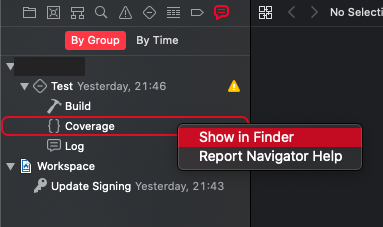

<p align="center">

<h1 align="center">Coverage Dirs</h1>
</p>

View xcode coverage data by folder

Go from this:
<p align="center">

</p>

To this:

<p align="center">

</p>

## Usage

Find xcresults file from Report navigator in Xcode:
  


You can then drag and drop, or use open dialog to read the file.

## Getting JSON using terminal

Run
``` bash
xcrun xccov view --report --json <.xcresult file> | pbcopy
```
to copy coverage json. Paste the output to Coverage Dirs (it will already be in clipboard because of `pbcopy`)

You can open JSON input in Coverage Dirs in: `File > Input JSON` (&#x2318; + I )
